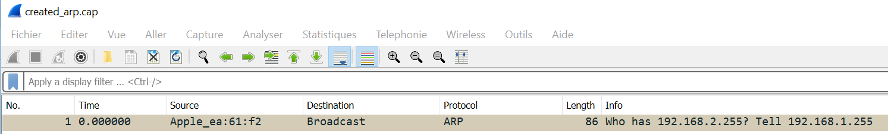
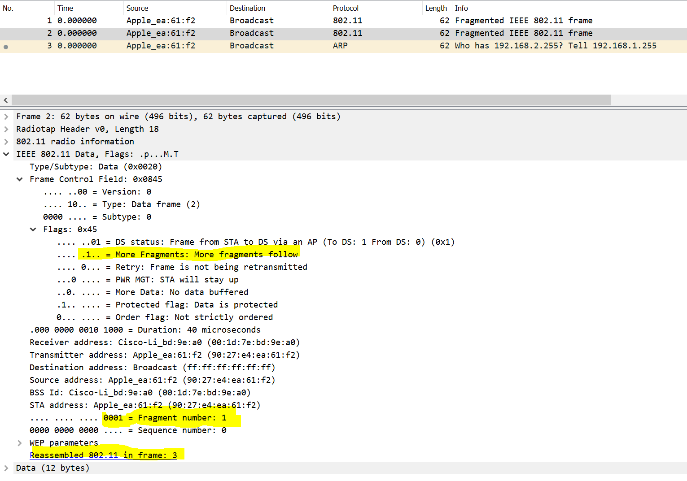

# Labo SWI 1 
## 1. Déchiffrement manuel de WEP
* Avec wireshark : 
  Après dechiffrement la capture est en clair:

et le decrypted wep data : 

* Avec le script python : 

Le script fonctionne de cette manière : 
* avec `rdpcap` on choisit la capture arp (dans le système de fichier)
* On définit la "seed" à la ligne 23 (`seed = arp.iv + key`), l'iv est en clair dans la capture (comme montré dans les slides)
* récuperation de l'icv chiffré dans la capture et du texte chiffré dans des variables
* le déchiffrement RC4 se fait avec la fonction `RC4` qui prends la graine paddée avec la clef en paramètre
* pour récuperer le plaintext la fonction `cipher.crypt`  sur le message chiffré est appelée. 
* ensuite l'icv en clair et le message en clair sont extraite du résultat ( icv 4 dernier octet et le texte clair tout sauf les 4 dernier octet) 
*  les valeurs sont ensuite print 

## 2. Chiffrement manuel de WEP

On procède exactement de la même manière sauf qu'au lieu de lire une capture chiffrée on va créer nous même notre capture en clair puis la chiffrer. 

Voici la capture d'écran, on voit qu'on arrive bien à lire notre requête chiffrée:

## 3. Fragmentation 

Dans cette partie nous allons réutiliser la partie 2, et découper notre message en 3 paquets.

Pour cela, nous faisons attention à:

- Chaque fragment est numéroté. La première trame d’une suite de fragments a toujours le numéro de fragment à 0. On incrémente le compteur de fragments, avec le champ « SC » de la trame. On fait une boucle for sur le nombre de fragments à envoyer et on inscrit dans arp.SC le numéro de l'itération
- Tous les fragments sauf le dernier ont le bit `more fragments` à 1, pour indiquer qu’un nouveau fragment va être reçu
- On doit également mettre le `arp[RadioTap].len` à `None`, afin qu'on réinitialise la taille du paquet pour qu'il se mette automatiquement à jour.

On peut voir avec la capture d'écran ci dessous que Wireshark interprète bien les 3 fragments, et récupère le sens de la requête ARP. On voit aussi que les flags des paquets sont bien sets.

