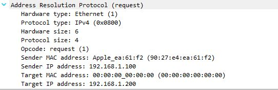
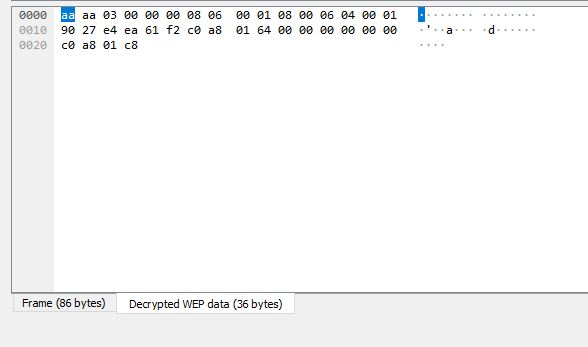
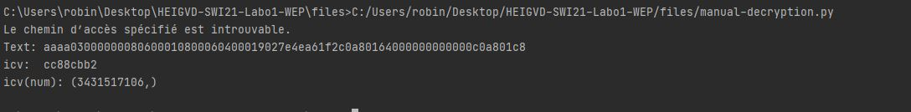

# Labo SWI 1 
## 1. Déchiffrement manuel de WEP
* Avec wireshark : 
  Après dechiffrement la capture est en clair:

et le decrypted wep data : 

* Avec le script python : 

Le script fonctionne de cette manière : 
* avec `rdpcap` on choisit la capture arp (dans le système de fichier)
* On définit la "seed" à la ligne 23 (`seed = arp.iv + key`), l'iv est en clair dans la capture (comme montré dans les slides)
* récuperation de l'icv chiffré dans la capture et du texte chiffré dans des variables
* le déchiffrement RC4 se fait avec la fonction `RC4` qui prends la graine paddée avec la clef en paramètre
* pour récuperer le plaintext la fonction `cipher.crypt`  sur le message chiffré est appelée. 
* ensuite l'icv en clair et le message en clair sont extraite du résultat ( icv 4 dernier octet et le texte clair tout sauf les 4 dernier octet) 
*  les valeurs sont ensuite print 

## 2. Chiffrement manuel de WEP

On procède exactement de la même manière sauf qu'au lieu de lire une capture chiffrée on va créer nous même notre capture en clair puis la chiffrer. 

Pour créer le paquet arp cette [documentation](https://0xbharath.github.io/art-of-packet-crafting-with-scapy/scapy/creating_packets/index.html) est suivie. 

